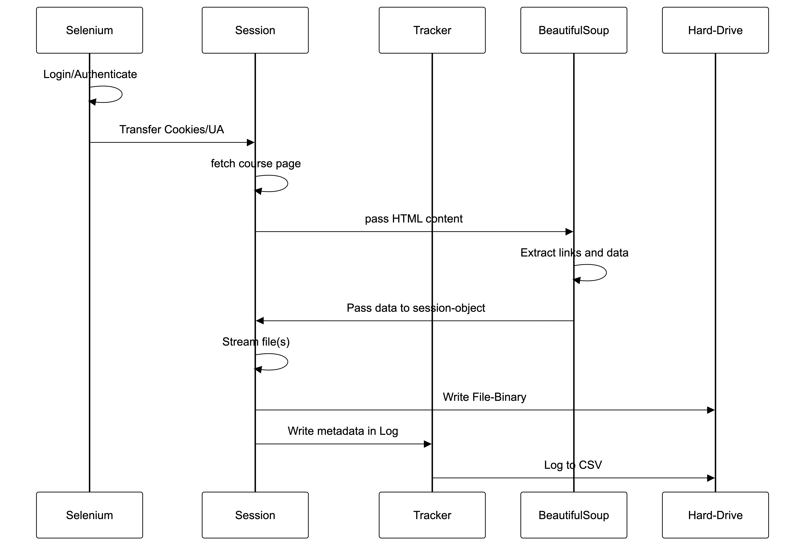

   
   <p align="center">
⠀⠀⠀⠀⠀⠀⠀⠀⠀⠀⠀⠀⠀⠀⠀⠀⠀⠀⠀⠀⠀⠀⠀⠀⢀⣠⡄⠀⠀⠀⠀⠀⠀⠀⠀⠀⠀⠀⠀⠀⠀⠀⠀⠀⠀
⠀⠀⠀⠀⠀⠀⠀⠀⠀⠀⠀⠀⠀⠀⠀⠀⠀⠀⠀⠀⠀⠀⠀⠀⣿⣿⣧⠀⠀⠀⠀⠀⠀⠀⠀⠀⠀⠀⠀⠀⠀⠀⠀⠀⠀
⠀⠀⠀⠀⠀⠀⠀⠀⠀⠀⠀⠀⠀⠀⠀⠀⠀⠀⠀⠀⠀⠀⠀⠀⣿⣿⢯⢙⠀⠀⠀⠀⠀⠀⠀⠀⠀⠀⠀⠀⠀⠀⠀⠀⠀
⠀⠀⠀⠀⠀⠀⠀⠀⠀⠀⠀⠀⠀⠀⢀⠀⢀⣀⣀⣠⡤⠄⠂⢩⠏⡟⠀⠀⠀⠀⠀⠀⠀⠀⠀⠀⠀⠀⠀⠀⠀⠀⠀⠀⠀
⠀⠀⠀⠀⠀⠀⠀⠀⡠⠄⠒⠉⢉⣩⡭⠽⡋⢩⡭⡟⠀⠀⢠⡟⠀⡇⠀⠀⠀⠀⠀⠀⠀⠀⠀⠀⠀⠀⠀⠀⠀⠀⠀⠀⠀
⠀⠀⠀⠀⠀⠀⡠⠊⠔⠀⠌⣉⠗⠉⡆⠘⠠⢈⢹⠁⠀⢀⡟⠀⢠⡇⠀⠀⠀⠀⠀⠀⠀⠀⠀⠀⠀⠀⠀⠀⠀⠀⠀⠀⠀
⠀⠀⠀⠀⢀⠜⠀⠄⠒⣸⠞⠰⡄⠂⠌⠠⢁⣢⠏⠀⢀⡾⠀⠀⢸⡇⠀⠀⠀⠀⠀⠀⠀⠀⠀⠀⠀⠀⠀⠀⠀⠀⠀⠀⠀
⠀⠀⠀⠀⡜⠠⠘⠠⢣⢃⢠⠀⢃⡘⢸⢀⢄⡟⠀⠀⣸⠃⠀⠀⠀⡇⠀⠀⠀⠀⠀⠀⠀⠀⠀⠀⠀⠀⠀⠀⠀⠀⠀⠀⠀
⠀⠀⠀⣼⠊⢀⠁⡶⢁⠂⠔⡈⢱⠈⢲⢤⡞⠀⠀⣰⠇⠀⢄⠀⠀⡧⠀⠀⠀⠀⠀⠀⠀⠀⠀⠀⠀⠀⠀⠀⠀⠀⠀⠀⠀
⠀⠀⢰⠁⡐⠀⡞⠁⡆⢈⠒⣄⢸⠢⢫⠏⠀⠀⢠⡏⠀⠀⢸⠀⠀⣿⠀⠀⠀⠀⠀⠀⠀⠀⠀⠀⠀⠀⠀⠀⠀⠀⠀⠀⠀
⠀⠀⡾⠂⠠⡵⠑⠢⢁⠂⣃⢸⠷⣴⠇⠀⠀⠀⡿⠀⠀⠀⡅⠀⠀⢸⡄⠀⠀⠀⠀⠀⠀⠀⠀⠀⠀⠀⠀⠀⠀⠀⠀⠀⠀
⠀⢰⡇⠠⣱⠃⡘⠰⢈⣂⡙⣾⠟⠁⠀⠀⠀⣼⠁⠀⠀⠀⠀⠀⠀⠘⣇⠀⠀⠀⠀⠀⠀⠀⠀⠀⠀⠀⠀⠀⠀⠀⠀⠀⠀
⠀⢸⡇⣽⢣⢰⡐⢧⣸⣭⠟⠁⠀⠀⠀⠀⢰⡏⠀⠀⠀⠀⠈⠀⠀⠀⢻⡀⠀⠀⠀⠀⠀⠀⠀⠀⠀⠀⠀⠀⠀⠀⠀⠀⠀
⠀⣼⣗⡯⣼⣆⣿⠶⠛⠁⠀⠀⠀⠀⠀⠀⡾⠀⠀⠀⠀⠀⠃⠀⠀⠀⠀⣧⠀⠀⠀⠀⠀⠀⠀⠀⠀⠀⠀⠀⠀⠀⠀⠀⠀
⠀⣇⣿⠿⠿⠛⠁⠀⠀⠀⠀⢸⠀⠀⠀⢸⠇⠀⠀⠀⠀⠀⠀⠀⠀⠀⠀⠸⣆⣠⡤⢤⣤⣤⠤⢄⣀⠀⠀⠀⠀⠀⠀⠀⠀
⣹⠋⠁⠀⠀⠀⠀⠀⠐⠄⠀⠈⠀⠀⠀⣾⠀⠂⠀⠀⠀⠀⠀⠀⢀⣠⡖⢻⢿⡷⣿⢿⡻⢛⣻⣦⣤⣿⢶⣄⠀⠀⠀⠀⠀
⠁⠀⠀⠀⠀⠀⠀⠀⠀⠂⠀⠀⠀⠀⢸⡇⠀⠀⠀⠀⠀⠀⢀⠴⢻⣝⣘⣧⢿⣿⡿⠛⠋⠉⠀⠀⠀⠀⠙⢳⣗⡄⠀⠀⠀
⠀⠀⠀⠀⠀⠀⠀⣀⠤⠒⣂⣟⣿⢿⣿⣷⣦⣄⣀⠀⠀⢠⠯⢊⣀⡴⣶⣿⣿⣭⡲⣕⣣⣞⣌⡶⣰⡄⣤⣬⣿⣿⡄⠀⠀
⠀⠀⠀⠀⢀⠔⡩⢀⣶⣾⣿⢿⣿⣿⣿⠻⣿⣿⣷⢷⣦⣷⣿⣳⣯⣿⣿⣽⣿⣿⣿⣿⣿⣿⣿⣿⣷⣿⣿⣿⣿⢿⣾⠀⠀
⠀⠀⠀⣴⠁⠂⠁⢿⡿⣿⣯⣿⣾⣿⣿⣷⡧⣄⣿⡾⣼⢯⣿⣿⣿⣿⣿⣿⣿⣿⣿⣿⣿⣿⣿⣿⣿⣿⢯⣿⣝⢮⡜⡇⠀
⠀⠀⣼⡷⠀⠀⢀⡈⣙⢓⡚⢿⣾⣿⣿⣿⣿⣽⣿⡽⣯⣟⡾⣿⣿⣿⣿⣿⣿⣿⣿⣿⣿⣿⣿⣿⣿⣿⣿⡾⣝⡎⠶⡇⠁
⠀⢸⣿⡇⠠⢄⠣⣜⢬⢣⣛⢧⣯⣟⣿⣿⣿⣿⡿⣿⣟⣾⣿⣿⣿⣿⣿⣿⣿⣿⣿⣿⣿⣿⣿⣿⣿⣿⣷⢿⡝⣮⢱⠇⠀
⠀⣾⣿⣿⣵⣮⣷⣾⣭⣷⣿⣿⣿⣿⣿⣿⣯⣷⣿⣿⢿⣿⣾⣿⣿⣿⣿⣿⣿⣿⣿⣿⣿⣿⣿⣿⣿⣿⢾⡟⣾⡅⡟⠀⠀
⠀⣿⣿⣿⣿⣿⡟⣿⣿⣿⣿⣿⣿⣿⣿⣷⣿⣿⣽⣿⣿⣿⣿⣿⣿⣿⣿⣿⣿⣿⣿⣿⣿⣿⣿⣿⣿⣽⣯⣿⣽⡜⠁⠀⠀
⠀⢸⣿⣿⠿⣽⣻⡽⣯⣿⡽⣿⣿⢿⣿⣿⣻⣽⣿⣷⣿⣿⣿⣿⣿⣿⣿⣿⣿⣿⣿⣿⣿⣿⣿⢿⣽⣳⢯⢳⠵⠁⠀⠀⠀
⠀⠀⢻⣯⣟⣳⢯⣟⡷⣯⣟⡷⣿⣻⣿⣽⣿⢿⣳⣿⣿⣾⣿⣿⡿⢿⣿⣿⣿⣿⣿⣿⣿⣿⢯⣟⡾⣹⠞⠁⠀⠀⠀⠀⠀
⠀⠀⠈⢿⡜⣭⢟⡾⣽⣳⢿⣽⣻⣿⣽⢿⣾⣿⢿⣯⣿⣿⣿⣿⠇⠀⠉⠛⠻⠿⢿⣷⡻⠾⠿⠚⠋⠁⠀⠀⠀⠀⠀⠀⠀
⠀⠀⠀⠀⠻⣌⠻⣼⢳⣯⣟⡾⣷⣻⣯⣿⣻⣾⡿⣿⣻⣷⣿⠋⠀⠀⠀⠀⠀⠀⠀⠀⠀⠀⠀⠀⠀⠀⠀⠀⠀⠀⠀⠀⠀
⠀⠀⠀⠀⠀⠈⠳⢜⡳⢮⡽⣛⣷⣻⣽⡷⣿⢯⣿⣿⡿⠟⠁⠀⠀⡆⠀⠀⠀⠀⠀⠀⠀⠀⠀⠀⠀⠀⠀⠀⠀⠀⠀⠀⠀
⠀⠀⠀⠀⠀⠀⠀⠀⠉⠓⠫⠽⠾⠽⠾⠽⠯⠟⠛⠁⠀⠀⠀⠀⠀⠁⠀⠀⠀⠀⠀⠀⠀⠀⠀⠀⠀⠀⠀⠀⠀⠀⠀⠀⠀
⠀⠀⠀⠀⠀⠀⠀⠀⠀⠀⠀⢀⠀⠀⠀⠀⠀⠀⠀⠠⠀⠀⢣⠀⠀⠀⠀⠀⠀⠀⠀⠀⠀⠀⠀⠀⠀⠀⠀⠀⠀⠀⠀⠀⠀
⠀⠀⠀⠀⠀⠀⠀⠀⠀⠀⠀⠀⠀⠀⠀⠀⠀⠆⠀⠀⠀⠀⠀⠀⠀⠀⠀⠀⠀⠀⠀⠀⠀⠀⠀⠀⠀⠀⠀⠀⠀⠀⠀⠀⠀
   </p>

   <h1 align="center">CherryPicker</h1>
   <p align="center">
     <em>A automated companion for harvesting university course materials with precision and speed</em>
   </p>

   ---

   ## 1. Overview

   Some people will call it "web-scraper". I call it **"a personal high-performance Python automation tool"** designed to "cherry-pick" (download) resources from my university portal. Killing the tedious process of manually checking for new lecture slides, assignments, and readings across multiple course pages.

   ### Idea
   
   By employing a **Hybrid Scraping Architecture**, UniLooter combines the best of two worlds:
   - **Selenium (Headless):** Handles complex SSO/Moodle authentication flows.
   - **Requests & BeautifulSoup4:** Executes high-speed scraping and multi-threaded-like downloads once the session is established.
  
   With that idea in my mind, I wanted to create

   ### Key Features
   - **Automated Login:** Handles credentials and session metadata extraction via Selenium.
   - **Smart Organization:** Automatically sorts files into folders named after your courses.
   - **Duplicate Prevention:** Tracks download history in a CSV file to avoid redundant downloads.
   - **Filename Sanitization:** Automatically cleans up special characters (e.g., German Umlauts) and removes invalid symbols.
   - **Rich CLI:** Provides beautiful progress bars and status updates using the `Rich` library.


   ### Motivation

   The portal from my university was clunky and is cumbersome to navigate. Bad UI requieres multiple clicks and logins to find the needed materials. In the one hand, this is especially annoying when it was time to prepare for exams. But on the other hand it's just annoying to download multiple files at once, open the downloads folder, select the files and dragging them into the designated location. 

   I created that project mainly because of three reasons:
   1.  **Saving Time:** Automate the repetitive `Search ->Check -> Download -> Move` cycle. Although we're talking just about minutes. On the long run (think about one semester) each saved minutes add up.
   2.  **Cure my nerves:** The plattform is quite annoying. Like I already said it has bad UI an even more worse search system and everything is cluttered. So I want to spare my own nerves and my peace of mind. 
   3.  **Ensure Consistency:** Each file is always stored in a dedicated place. My system, my location. Always the same.

   And so it will help you! 


   ### How it works

   To maximize both compatibility and performance, this project uses a **Hybrid Scraping Workflow**. Selenium is used to bypass the authentication of the platform, while the combination of BeautifulSoup and Requests handles the scraping and streaming of the actual files onto the hard-drive.

   


   First, a **Selenium WebDriver** instance is created to handle the complex login flow. Once the session is authenticated, the credentials (`cookies` and `User-Agent`) are transferred to a lightweight **Requests Session** for high-performance interaction. This session fetches each course page, which **BeautifulSoup** then parses to identify and extract specific resource links. Before the download starts, the **Tracker** compares each link against all entries of the local CSV-file (`download_history.csv`). If the file is new, the authenticated session streams it directly via **Streaming Requests** to the hard-drive and stores the file data inside the `download_history.csv`-file. If the file has been already downloaded the provided resource-link will be skipped.

   ---

   ## 2. Getting Started

   ### Prerequisites
   - **Python 3.13+** 
   - **Google Chrome** & **ChromeDriver** (for Selenium's headless operation)
   - **UV** (recommended dependency manager)

   ### Installation

   1.  **Clone the repository:**
      ```bash
      git clone https://github.com/your-username/uni-looter.git
      cd uni-looter
      ```

   2.  **Install dependencies:**
      ``` 
      uv sync
      ```

   ### Configuration

   3.  **Environment Variables:** Create a `.env` file in the root directory:
      ```env
      LOGIN_URL=https://your-university-moodle.com
      USER_NAME=your_username
      PASSWORD=your_password
      ```

   4.  **Course List:** Define the courses you want to track in `src/files/courses.json`. Each course idea is visible in the URL as the last parameter:
      ```json 
      [
        {
          "id": 12873,
          "name": "Artificial Intelligence"
        }
      ]
      ```


   ## 5. Contributing

   Currently this project only works with moodle-plattform from the DHBW (Karlsruhe). But in order to make this project usable for everybody feel free to **clone** and **participate** in this project. 
   You can find more informations about how to participate in the [Contribution guidelines](./CONTRIBUTING.md) 


   ## 6. Development

   **Linting & Formatting:**
   ```bash
   uv run ruff check .   # Check for errors
   uv run ruff format .  # Format code
   ```

   **Testing:**
   ```bash
   uv run -m pytest
   ```

   ## 3. Caveats

   Althought the test-coverage is pretty good, there are some caveats you have to watch out for when using this:
   5. You need to be logged out from all active sessions

   <p align="center">Made for more efficient studying 🍒</p>


